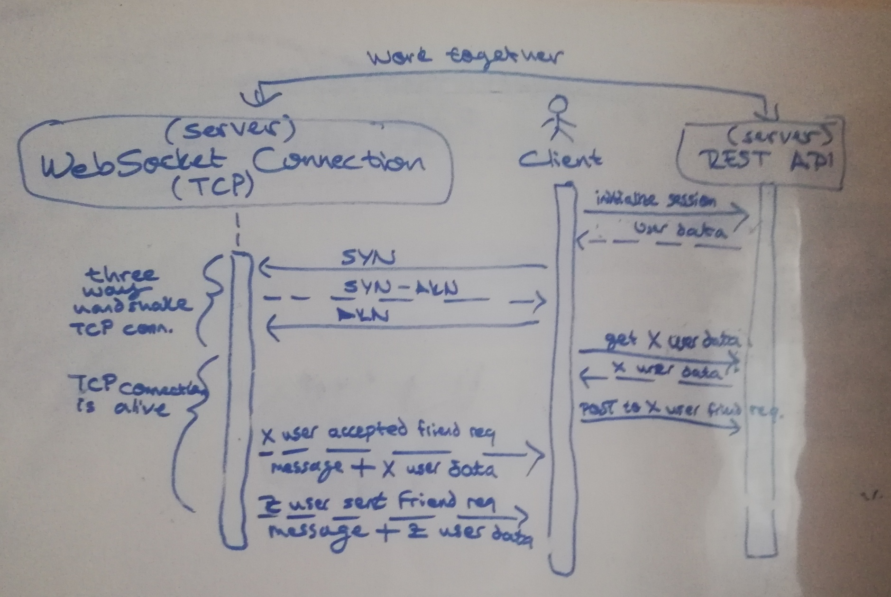

# Full Stack Mobile Chat App

## Contents
  
  - 1. Introduction
  - 2. Client Side
    - 2.1. UML
    - 2.2. Memory
  - 3. Server Side
    - 3.1. Applied Logic 
    - 3.2. NoSQL Database 
  - 4. Screenshots
  - 5. Video Demo

## 1. Introduction

**Warning: There is little left to finish the application. It needs to add the user registration screens, notifications in the background and the data updates of friend requests and new friends via sockets.**

For now, the application has been developing for a month, a month in which it went through periods of time implementing each basic requirement.

Upon completion of the basic requirements, the new requirements detected and the remaining more complex ones will continue to be implemented.

## 2. Client Side

The creation of the application started with simple sketches of the graphical interface. These sketches were lost for this reason I can't put them here. Please see the last section where photos of the project are shown.

The graphical interface was implemented while using static test data.

### 2.1. UML

This is the first project that by far has a big difference from the old ones I've done. I have tried in the most logical and optimal way possible to use design patterns to have clean code and protect business logic.

In a time limit the design was implemented, design which had to be changed a bit (only the classes related to messages) due to the limitations of Hive.

- The builder design pattern was used to be able to build main and secondary users in an optimal and fast way.
- The observer design pattern was used to notify the client when data is received from the server (either via sockets or via rest api).
- The bridge design pattern was used to separate non-client related classes so that the client can call methods dynamically.

### 2.2. Memory

To give a fast and optimal application I have decided to save the messages in the device memory. To do this in a way I have used the hive tool, which serves as a local nosql database.

As an optimal solution, every time new messages come I will save them in the device, as well as in the ram so that the chat screen does not have to make the user wait. **Only the last message of the existing conversions of the device will be saved in the ram.**

Also here it should be noted that the users' profile images will be stored on the user's device, while the addresses of the local images will be stored in the ram.

## 3. Server Side

### 3.1. Applied Logic

To demonstrate the server logic see the image below.

Look at the image, which simulates a session of a user who sends a friend request to another user.

The example was given in order to see when the use of websockets would be needed and when the use of rest api.

Real-time operations like sending messages and friend requests will use websockets while operations like opening a session and updating a user's data will use the rest api.

This is the section which remains to be polished. Mainly missing is to optimize the rest api code (in a more correct way), add new methods to the channels part to add new notifications and add methods to the rest api and channels for users to register.

### 3.2. NoSQL Database

To give a better user experience (in the sense of speed) it was necessary to use a nosql database, because in this way the user's data can be accessed more quickly.

Clearly, this thought cannot be said to be correct, because since there are relationships between the identities, data from other users related to the main user will have to be updated.

Soon this section can be changed and remodeled. For now the logic of the model is very basic, each user will contain messages which have not yet been read, usernames which are their friends, usernames which have sent friend requests and data such as username, images (encrypted) and more. 

It should also be noted that django does not yet officially have nosql database integrations, for this reason I have used the **djongo tool**, which is very curious and very useful, it applies sql models to mongodb to protect business logic.

## 4. Screenshots

 
 
 
 

 

 
 
 

 

 

 

## 5. Video Demo

https://user-images.githubusercontent.com/57767201/159140498-498e296a-17e8-49eb-aad6-7dcb3d81e685.mp4
